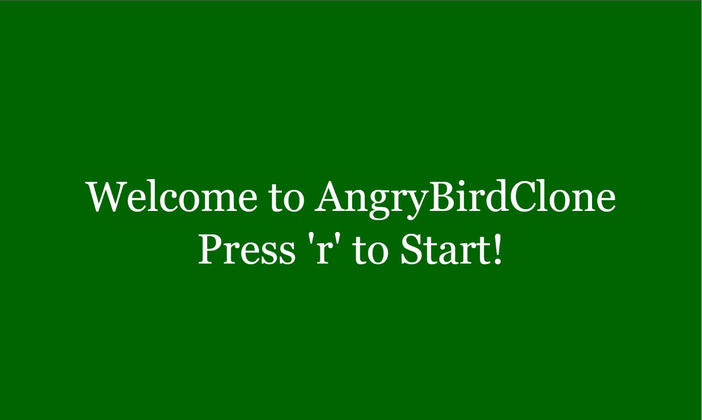
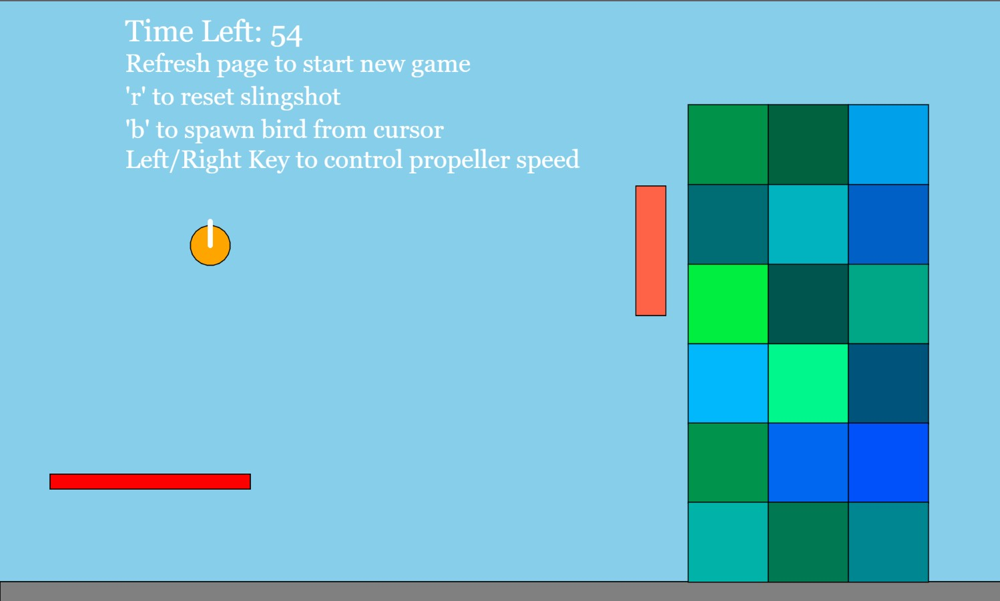
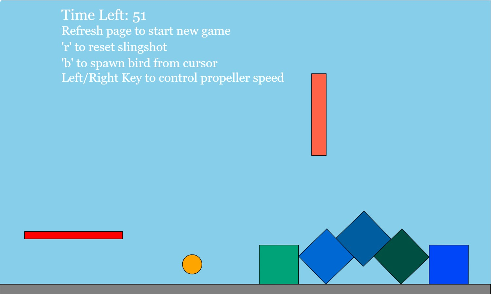
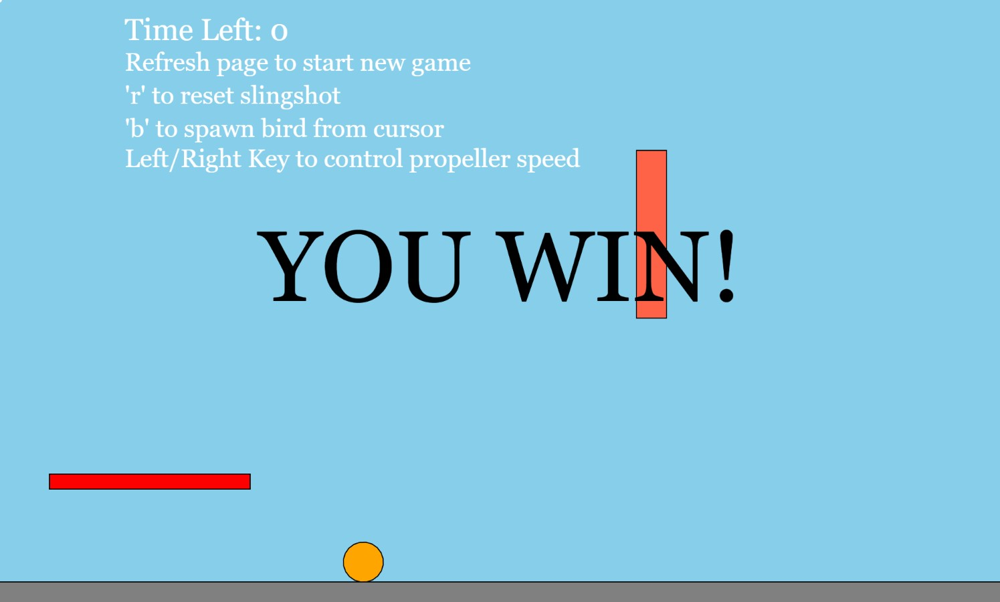

# AngryBirdsClone
p5.js game project - Angry birds clone

Angry Birds Clone is a game where users are able to slingshot balls at bricks, knocking it off the screen.

<h1>Steps to run Angry Birds Clone:</h1>
&nbsp; 1) Download Brackets --------> https://brackets.io/  
&nbsp; 2) Clone repository  
&nbsp; 3) Run debugger to view the game.

<h1>Language/Library/Frameworks used: </h1>
&nbsp; 1) Javascript  
&nbsp; 2) p5.js --------> https://p5js.org/ 

<h1>Demo of game being played:</h1>  
<video width="500" height="400">
  <source src="./video/Angrybirdclone.mp4" type="video/mp4"/>
</video>

<!-- <h1>Start of game: Press 'r' to start the game</h1>

<h1>In game: Click on ball and drag, Release to launch the ball</h1>

<h1>In game: After slingshotting the ball, bricks were knocked out</h1>

<h1>End game: After bricks slingshotted out of the screen</h1>
 -->